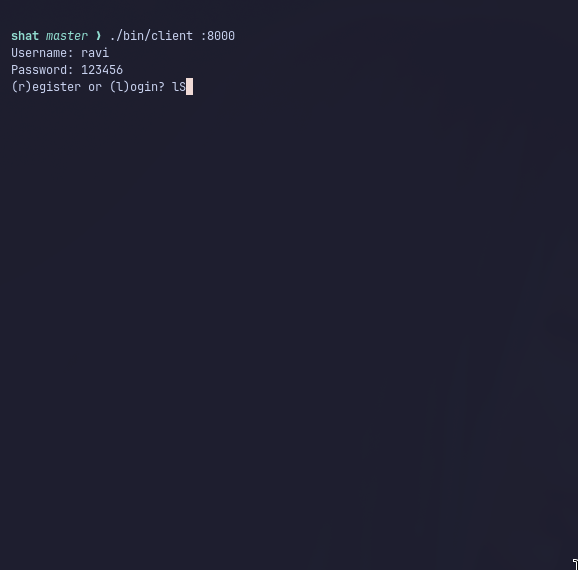
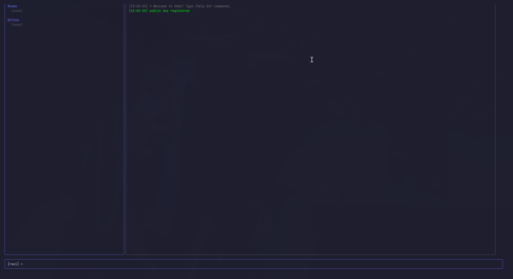
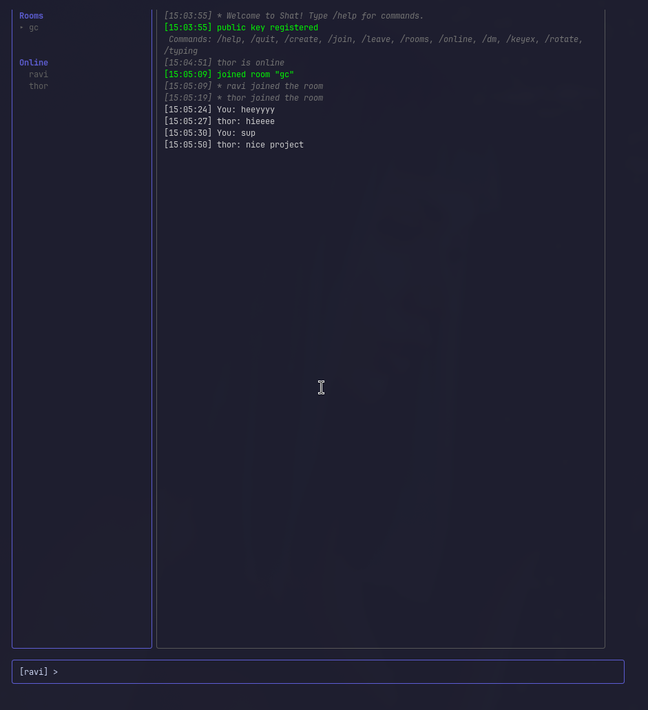
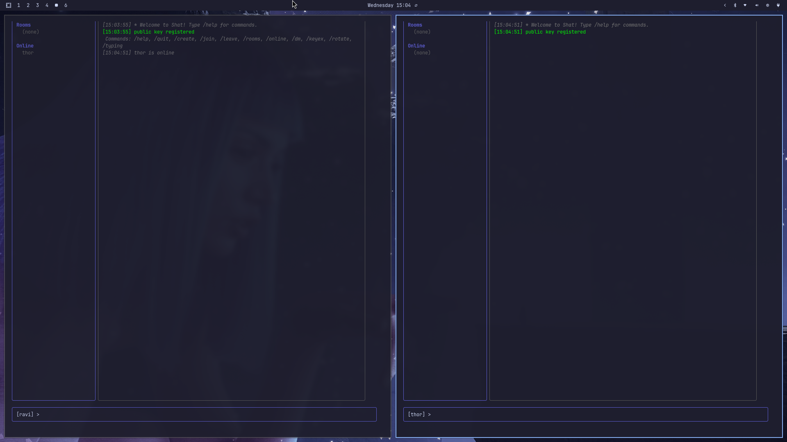
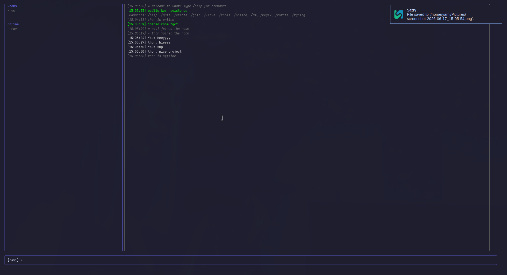
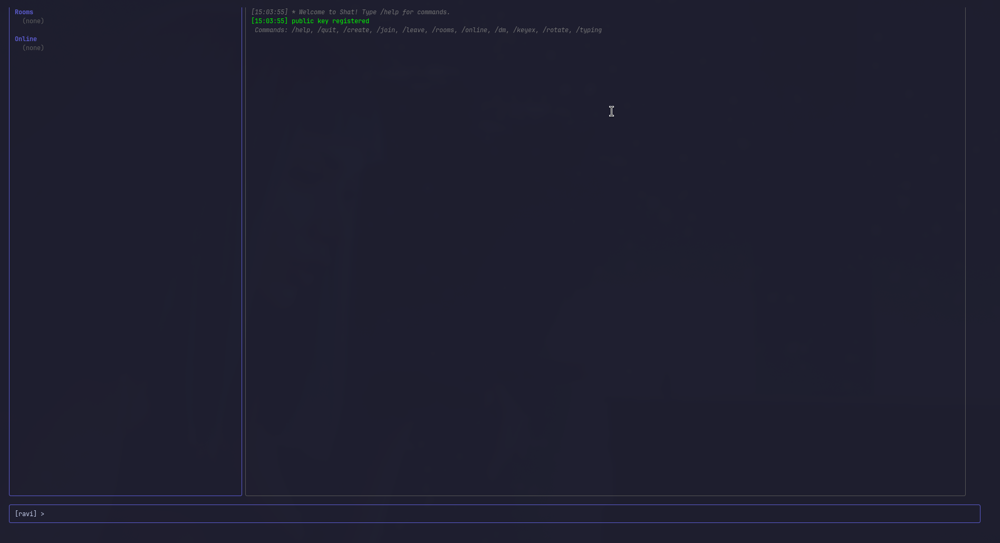
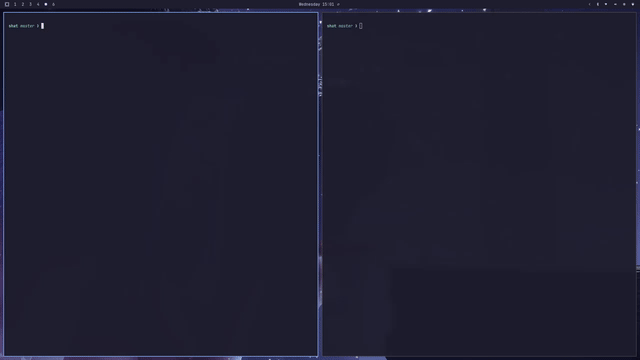

# Shat

A terminal-based TCP chat application built in Go, featuring end-to-end encryption, multi-room support, and a Bubble Tea TUI.

## Screenshots

### Login


### Home


### Chat Room


### Multiple Users Online


### User Offline Notification


### All Commands


## Demo



## Features

### Tier 1 -- Core
- **End-to-End Encryption** -- RSA-2048 key pairs + AES-256-GCM. Server never sees plaintext.
- **SQLite Persistence** -- Messages, users, rooms stored in SQLite with offline message queue.
- **Multi-Room Support** -- Create, join, leave rooms. Direct messages between users.
- **User Authentication** -- Username/password with bcrypt hashing. Session tokens.

### Tier 2 -- Polish
- **Proper Protocol Framing** -- 4-byte length-prefixed binary protocol with JSON envelopes.
- **Presence System** -- Online/offline status, typing indicators.
- **Testing** -- 30+ unit tests (crypto, protocol, DB, auth) with race detector.
- **CI/CD + Docker** -- GitHub Actions workflow, multi-stage Dockerfile, Makefile.

### Tier 3 -- Stretch
- **Rate Limiting** -- Token bucket per-client rate limiter.
- **Bubble Tea TUI** -- IRC-style layout with sidebar, messages, and input bar.

## Quick Start

```bash
# Build
make build

# Run server
./bin/server

# Run client (TUI mode)
./bin/client localhost:8000

# Run client (CLI mode)
./bin/client --cli localhost:8000
```

## Commands

| Command | Description |
|---------|-------------|
| `/help` | Show help |
| `/quit` | Disconnect |
| `/create <room>` | Create a new room |
| `/join <room>` | Join a room |
| `/leave` | Leave current room |
| `/rooms` | List all rooms |
| `/online` | List online users |
| `/dm <user> <msg>` | Send direct message |
| `/typing` | Send typing indicator |
| `/keyex <user>` | Initiate E2E key exchange |
| `/rotate <user>` | Rotate encryption key |

## Docker

```bash
docker-compose up
```

## Testing

```bash
make test          # run tests
make test-race     # run with race detector
make bench         # run benchmarks
make lint          # run golangci-lint
```

## Architecture

```
cmd/
  server/main.go       -- Server entrypoint
  client/main.go       -- Client entrypoint (TUI + CLI modes)
internal/
  types/types.go       -- Wire protocol message types
  protocol/            -- Length-prefixed framing (FrameConn)
  crypto/              -- RSA key pairs, AES-256-GCM, key exchange
  db/                  -- SQLite persistence layer
  auth/                -- bcrypt authentication
  hub/                 -- Client management, rooms, broadcasting
  client/              -- Client struct and read/write loops
  server/              -- TCP server, message routing, command handlers
  ratelimit/           -- Token bucket rate limiter
  tui/                 -- Bubble Tea IRC-style TUI
```

## License

MIT
